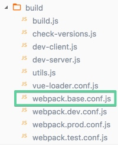
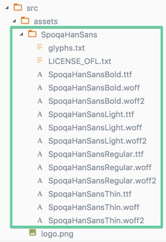
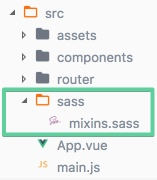
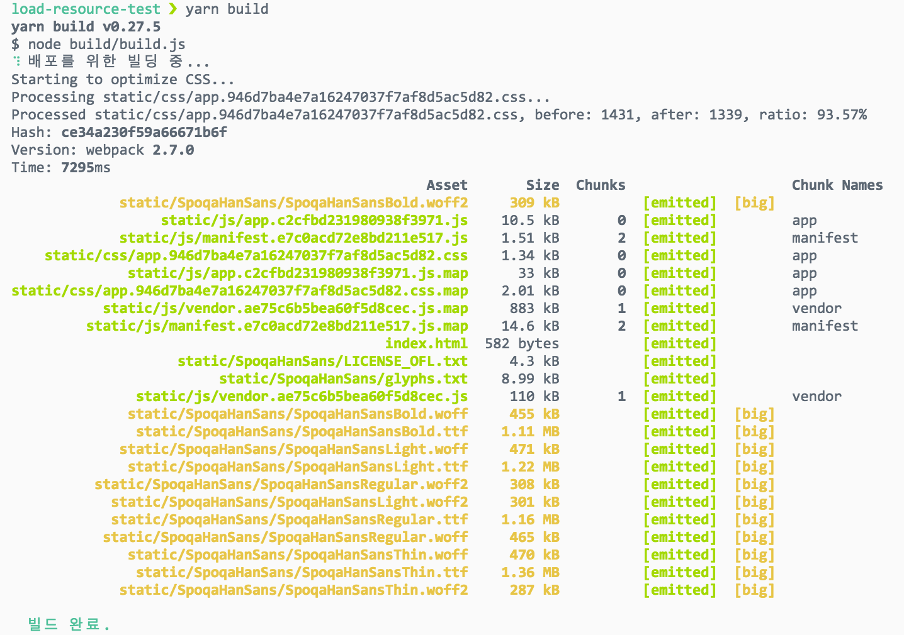
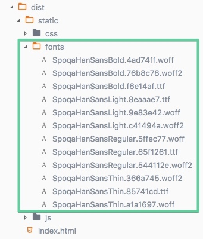

# Vue CLI 템플릿 `yamoo9/vue-full` 외부 리소스 설정

## 1. 별칭(Alias) 등록

외부 Sass 라이브러리 및 직접 작성한 리소스를 제공할 디렉토리를 생성한 후, 별칭 `sass`로 등록합니다.

```js
// build/webpack.base.conf.js
module.exports = {
  ...
  resolve: {
    alias: {
      'vue$' : 'vue/dist/vue.esm.js',
      '@'    : resolve('src'),
      // src 디렉토리 내부에 sass 디렉토리를 생성한 후, 별칭(alias)을 등록합니다.
      'sass' : path.resolve(__dirname, './src/sass'),
    }
  }
}
```




## 2. Sass 라이브러리(설정,믹스인 등) 추가

`sass` 디렉토리를 별칭으로 등록했기 때문에 내부에 라이브러리를 추가하고 사용할 수 있습니다.
확실한 사용 방법을 익히기 위해 웹폰트 **Spoqa Han Sans**를 사용하는 예제를 다뤄보겠습니다.

먼저 `src/assets` 디렉토리 내부에 Spoqa 폰트를 담은 디렉토리를 추가합니다.



이어서 등록된 `sass` 별칭 디렉토리 내부에 `mixins.sass` 파일을 생성합니다.



생성된 `mixins.sass` 파일 내부에 **Spoqa Han Sans** 웹폰트를 설정하는 믹스인을 작성합니다.

```sass
// src/sass/mixins.sass
@mixin spoqa( $path )
  @font-face
    font-family: 'Spoqa Han Sans'
    font-weight: 700
    src: local("Spoqa Han Sans Bold"), url("#{$path}/SpoqaHanSansBold.woff2") format("woff2"), url("#{$path}/SpoqaHanSansBold.woff") format("woff"), url("#{$path}/SpoqaHanSansBold.ttf") format("truetype")

  @font-face
    font-family: 'Spoqa Han Sans'
    font-weight: 400
    src: local("Spoqa Han Sans Regular"), url("#{$path}/SpoqaHanSansRegular.woff2") format("woff2"), url("#{$path}/SpoqaHanSansRegular.woff") format("woff"), url("#{$path}/SpoqaHanSansRegular.ttf") format("truetype")

  @font-face
    font-family: 'Spoqa Han Sans'
    font-weight: 300
    src: local("Spoqa Han Sans Light"), url("#{$path}/SpoqaHanSansLight.woff2") format("woff2"), url("#{$path}/SpoqaHanSansLight.woff") format("woff"), url("#{$path}/SpoqaHanSansLight.ttf") format("truetype")

  @font-face
    font-family: 'Spoqa Han Sans'
    font-weight: 100
    src: local("Spoqa Han Sans Thin"), url("#{$path}/SpoqaHanSansThin.woff2") format("woff2"), url("#{$path}/SpoqaHanSansThin.woff") format("woff"), url("#{$path}/SpoqaHanSansThin.ttf") format("truetype")
```

## 3. `App.vue` 파일 내부에서 웹폰트 사용 설정

`src/App.vue` 파일을 연 후, 스타일 코드 작성 영역 상단에 `@import 'sass/mixins'` 코드를 추가한 후, `+spoqa('./assets/SpoqaHanSans')` 믹스인 호출 코드를 추가합니다.

마무리로 body 영역에서 `font-family: 'Spoqa Han Sans'` 웹폰트를 사용하는 코드를 작성합니다.

```sass
// src/App.vue
<style lang="sass">
// sass 등록된 별칭 디렉토리 sass 내부에서 mixins.sass 로드
@import 'sass/mixins'

// spoqa 믹스인 사용 (상대경로)
+spoqa('./assets/SpoqaHanSans')

html
  font-size: 100%
  background: #fff

body
  margin: 0
  // 웹폰트 Spoqa Han Sans 사용
  font-family: 'Spoqa Han Sans'
```

## 4. 빌드(Build) 결과 확인

NPM 스크립트 `build`를 실행(`run`)합니다.

```sh
$ npm run build

# yarn 명령어를 사용할 경우
$ yarn build
```

명령을 실행하면 **배포를 위한 빌딩 중...** 메시지 표시 후, 리소스가 모두 번들링 되어 `dist` 디렉토리에 생성됩니다.



생성된 디렉토리 `dist` 내부를 살펴보면 `fonts` 디렉토리 안에 사용한 웹폰트가 포함된 것을 확인할 수 있습니다.



<!-- https://github.com/vuejs/vue-loader/issues/328#issuecomment-249175224 -->