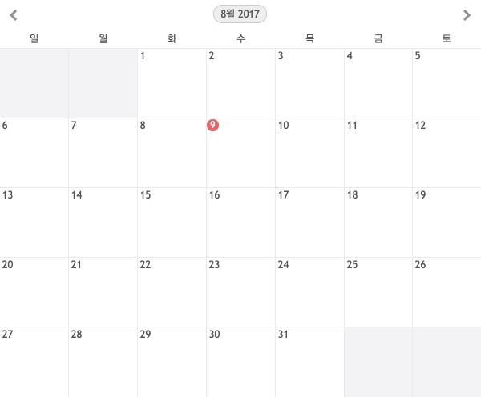

# VueJS 애플리케이션에 jQuery 플러그인 적용하기

VueJS와 jQuery를 함께 사용하는 것을 권장하는 것은 아니지만, 꼭 써야할 상황이라면 어떻게 해야 할까요?
VueJS를 사용해본 경험이 있다면 애플리케이션 UI를 구현하는데 있어 jQuery가 필수가 아니라는 것을 알고 있을 겁니다.

하지만 기존에 사용했던 jQuery 플러그인을 VueJS 코드로 변경하기에는 시간이 부족하거나,
부득이하게 jQuery를 그대로 사용해야 하는 상황이 있을 수 있겠죠. 이런 상황이 주어졌을 때 어떻게 해야 VueJS와 jQuery를 안전하게 사용할 수 있을까요?

jQuery 달력 플러그인 [Monthly](http://kthornbloom.com/monthly/)을 VueJS 애플리케이션에 안전하게 적용하는 방법을 살펴봅시다.



## VueJS와 jQuery를 함께 사용하면?

**문제가 발생할 수 있습니다.** VueJS는 Virtual DOM을 사용하여 변경된 부분만 패치(Patch)하여 업데이트 하기에 Actual DOM을 사용하는 jQuery를 함께 사용할 경우 문제가 발생하게 됩니다.

예를 들어 `el` 요소에 마운트 된 VueJS 인스턴스가 관리하는 것을 jQuery에 의해 변경하면, 다음 업데이트 시점에서 jQuery가 설정한 것을 덮어쓰게 되면서 제대로 동작하지 않게 됩니다.

## 해결 방법은?

**jQuery 플러그인을 Vue컴포넌트화 시켜야 합니다.** VueJS와 jQuery는 DOM을 공유하지 않기 때문에 VueJS로 하여금 jQuery에게 제어권을 넘기도록 설정해줘야 합니다.

jQuery 플러그인을 Vue 컴포넌트로 래핑하면 다음의 것을 수행할 수 있게 됩니다.

- VueJS 라이프 사이크 훅 함수를 사용하여 jQuery 플러그인을 설정/해제 할 수 있습니다.
- jQuery 플러그인에 전달할 데이터를 `props`, `$emit()`를 통해 전달하거나, 변경 요청할 수 있습니다.
- `v-once` 디렉티브를 사용하여 컴포넌트의 업데이트를 1회로 제한할 수 있습니다.

### jQuery 플러그인 Monthly 사용 방법

플러그인을 사용하기 위해서는 `jquery.js`, `monthly.js` 파일을 모두 로드한 후, 플러그인을 적용할 `<div>` 요소에 식별자를 설정한 다음, `$('#my-calendar').monthly();` 플러그인을 설정하면 됩니다.

```html
<! DOCTYPE html>
<html lang="ko-KR">
  <head>
    ...
    <link rel="stylesheet" href="css/monthly.css">
  </head>
  <body>
    ...

    <div class="monthly" id="my-calendar"></div>

    <script src="js/jquery.js"></script>
    <script src="js/monthly.js"></script>
    <script>
      // 옵션 참고: https://github.com/kthornbloom/Monthly/wiki/All-Options
      $('#my-calendar').monthly({
        weekStart: 'Mon', // 'Sun'
        mode: 'event',    // 'picker'
        dataType: 'json', // 'xml'
        jsonUrl: 'path/to/calendar.json'
      });
    </script>
  </body>
</html>
```

### Vue 컴포넌트 monthly 정의

`Vue.component()` 컴포넌트 구문을 사용하여 글로벌(전역)에 `y9-monthly` 이름으로 등록합니다. 내부에는 컴포넌트 템플릿을 작성합니다.

그리고 Vue 인스턴스 생성 구문을 작성하여 `.app` 요소에 마운트 합니다.

```js
// 글로벌 Vue 컴포넌트 `y9-monthly` 정의
Vue.component('y9-monthly', {
  template: '<div class="y9-monthly"></div>'
});


// Vue 인스턴스 생성
var app = new Vue({
  el: '.app'
});
```

이어서 `<y9-monthly>` 컴포넌트를 `<div class="app">` 내부에 추가합니다.

```html
<div class="app">
  <y9-monthly></y9-monthly>
</div>
```

지금까지 작성한 내용은 단순히 jQuery 플러그인을 래핑할 컴포넌트 구조만 만든 것일 뿐, 이제부터는 jQuery 플러그인 및 데이터 전달 등을 설정할 것입니다.

### jQuery 플러그인 설정

`mounted` 라이프 사이클 훅 함수를 사용하여 `this.$el` 문서 객체(`<div class="y9-monthly">`)를 jQuery 인스턴스로 생성한 후, 플러그인 `.monthly()`을 설정합니다.

```js
Vue.component('y9-monthly', {
  // 템플릿
  template: '<div class="y9-monthly"></div>',
  // 라이프 사이클 훅 함수: 마운트 된 이후 시점에 실행
  mounted: function(){
    // 컴포넌트 요소에 jQuery 플러그인 적용
    $(this.$el).monthly({
      weekStart: 'Mon',
      mode: 'event',
      dataType: 'json',
      jsonUrl: 'path/to/calendar.json'
    });
  }
});
```

### 컴포넌트에 속성 전달

컴포넌트를 재사용하려면 컴포넌트 외부에서 jQuery 플러그인에 적용할 옵션을 전달할 수 있게 구성해야 합니다. `props` 속성 `options`을 전달 받을 수 있도록 정의합니다.

```js
Vue.component('y9-monthly', {
  template: '<div class="y9-monthly"></div>',
  // 상위 컴포넌트에서 전달 받을 속성 설정
  // jQuery 플러그인 옵션 객체
  props: {
    options: {
      type: Object,
      default: {}
    }
  },
  mounted: function(){
    $(this.$el).monthly(this.options);
  }
});
```

이제 컴포넌트에 `:options` 속성을 통해 jQuery 플러그인 옵션을 전달할 수 있습니다.

```html
  <y9-monthly :options="{
    weekStart: 'Mon',
    mode: 'event',
    dataType: 'json',
    jsonUrl: 'path/to/calendar.json'
  }"></y9-monthly>
```

옵션을 컴포넌트에 직접 설정하지 않고 Vue 인스턴스 데이터 속성에 추가하여 관리하면 반응성이 적용됩니다.

```js
var app = new Vue({
  el: '.app',
  data: {
    // monthly_options 데이터 속성 추가
    monthly_options: {
      weekStart: 'Mon',
      mode: 'event',
      dataType: 'json',
      jsonUrl: 'path/to/calendar.json'
    }
  }
})
```

컴포넌트 코드는 아래와 같이 간결하게 변경됩니다.

```html
  <y9-monthly :options="monthly_options"></y9-monthly>
```

### 컴포넌트 업데이트

컴포넌트 데이터 속성은 Vue 인스턴스 생성 시점에 반응성이 적용되기에 애플리케이션이 실행 중인 상태에서 실시간 변경이 가능합니다.

예를 들어 아래 코드를 런타임 중에 실행하게 되면 주의 시작이 `월요일(Mon)`에서 `일요일(Sun)`로 변경 됩니다.

```js
app.monthly_options.weekStart = 'Sun';
```

하지만 이로 인해 jQuery 플러그인 코드가 Vue에 의해 제대로 동작하지 않을 가능성이 농후해집니다. jQuery 플러그인이 로드 시점에 처리한 결과를 Vue 컴포넌트가 업데이트 되면서 덮어쓸 수 있기 때문입니다.

그러한 이유로 jQuery 플러그인에서는 Vue의 반응성이 불필요하기에 1회만 적용되도록 설정해야 합니다.

### `v-once` 디렉티브

`v-once` 디렉티브를 사용하면 컴폰너트가 로드될 때에만 데이터 바인딩, 캐시 처리되어 더 이상 업데이트가 발생하지 않게 설정합니다. 실제로 jQuery 플러그인에 설정하는 옵션 값을 런타임 중에 바꿀 일은 거의 없습니다.

```html
  <y9-monthly :options="monthly_options" v-once></y9-monthly>
```

### Date Picker 플러그인으로 사용하려면?

Monthly 플러그인을 Date Picker로 적용할 경우, 사용자가 클릭한 달력 날짜를 `<input>` 요소의 값으로 설정됩니다. (`<input>` 요소 추가 필요)

컴포넌트 코드를 아래와 같이 변경합니다. 컴포넌트는 1개의 루트 요소만을 허용하기에 `.y9-monthly-wrapper` 래퍼 요소를 추가하고,
내부에 `<input>` 요소를 추가한 후, `v-if` 디렉티브 값에 따라 조건부 렌더링 되도록 처리합니다.

`<input>`을 조건부 처리하기 위한 값은 computed 속성 `mode_picker`의 결과입니다.
사용자가 전달한 옵션 객체의 `mode` 속성 값이 `'picker'`일 경우 값이 참이 되어 `<input>`이 렌더링 되게 됩니다.

사용자가 외부에서 전달할 `target` 속성 값은 `<input>` 요소의 `id` 값으로 동적 바인딩 설정되도록 `:id` 값으로 `'target'`을 설정합니다.

```js
Vue.component('y9-monthly', {
  // 루트 엘리먼트 추가 및 인풋 요소 추가
  template: '\
    <div class="y9-monthly-wrapper">\
      <input :id="target" type="text" v-if="mode_picker">\
      <div class="y9-monthly"></div>\
    </div>\
  ',
  props: {
    options: {
      type: Object,
      default: {}
    },
    // 사용자가 전달한 target 값은 인풋 요소의 id로 설정 됨.
    target: {
      type: String,
      default: ''
    }
  },
  mounted: function(){
    $(this.$el).monthly(this.options);
  },
  // 옵션 mode 값이 picker 일 경우, 계산된 값을 반환하는 속성 mode_picker 정의
  computed: {
    mode_picker: function(){
      return this.options.mode === 'picker';
    }
  }
});
```

[Monthly 플러그인 Date Picker 옵션 사용법](https://github.com/kthornbloom/Monthly/wiki/Date-Picker)을 참고하여 아래와 같이 Vue 인스턴스 내부에 데이터 속성 값을 설정할 경우,
Date Picker로 플러그인이 사용됩니다.

```js
var app = new Vue({
  el: '.app',
  data: {
    // monthly_options 데이터 속성 추가
    monthly_options: {
      mode: 'picker',
      // 사용자가 선택한 날짜를 값으로 받을 input 요소 선택자
      target: '#unique-id',
      // true로 설정할 경우, 사용자가 input을 클릭해야만 달력이 보임
      startHidden: true,
      // 클릭할 경우, 화면에 보여질 요소
      showTrigger: '#unique-id',
      // 이전 요일에 스타일 적용
      stylePast: true,
      // 이전 요일 클릭 불가능 설정
      disablePast: true
  }
})
```

마무리로 컴포넌트에 `options`, `target` 속성을 설정하여 Date Picker 플러그인을 사용합니다.

```html
  <y9-monthly :options="monthly_options" target="unique-id" v-once></y9-monthly>
```

### 상위 컴포넌트에 이벤트를 발생시켜 데이터 전달

마무리로 `<input>` 요소의 값이 변경되면 이를 상위 컴포넌트에 전달해야 하는 상황이 필요하다고 가정해 봅시다.
이런 경우, Vue 컴포넌트는 상위 컴포넌트에 이벤트를 발신하여 값을 전달할 수 있는 기능을 제공하고 있어 이를 활용하면 됩니다.

먼저 `<input>` 요소에 `@input`, `:value` 디렉티브 속성을 추가하여 이벤트가 발생하면 `selectDate` 메서드를 실행하고,
처리 결과 값을 date로 받아 동적 바인딩 되도록 준비합니다.

이어서 `data` 속성 `date` 초기 값을 등록하고, `selectDate` 메서드도 등록합니다. (각 설정은 아래 코드 주석을 통해 살펴보세요)

```js
Vue.component('y9-monthly', {
  // <input> 요소에 @input, :value 설정
  // @input 이벤트 발생 시, selectDate 메서드 실행
  // :date 데이터 속성 date 값 변경 시, 동적 바인딩
  template: '\
    <div class="y9-monthly-wrapper">\
      <input :id="target" type="text" v-if="mode_picker" @input="selectDate" :value="date">\
      <div class="y9-monthly"></div>\
    </div>\
  ',
  props: {
    options: {
      type: Object,
      default: {}
    },
    // 사용자가 전달한 target 값은 인풋 요소의 id로 설정 됨.
    target: {
      type: String,
      default: ''
    }
  },
  mounted: function(){
    $(this.$el).monthly(this.options);
  },
  // <input> 요소의 값으로 처리될 date 속성 추가
  data: function(){
    date: ''
  },
  computed: {
    mode_picker: function(){
      return this.options.mode === 'picker';
    }
  },
  methods: {
    // selectDate 메서드 등록
    selectDate: function(e){
      // <input>의 값을 value로 설정
      var value = e.target.value;
      // 데이터 속성 date 업데이트
      this.date = value;
      // 상위 컴포넌트와 통신
      // update-date 이벤트 키에 value 전달
      this.$emit('update-date', value);
    }
  }
});
```

컴포넌트 코드에는 `@update-date="updateDate"` 코드를 추가하여 컴포넌트가 발신하는 이벤트를 수신할 준비를 합니다.

```html
  <y9-monthly :options="monthly_options" target="unique-id" @update-date="updateDate" v-once></y9-monthly>
```

상위 컴포넌트 격인 Vue 인스턴스에는 `data` 속성을 추가한 후, 이를 전달 받을 속성 `date`를 추가합니다.
그리고 `updateDate` 메서드를 등록하면 마무리 됩니다.

```js
var app = new Vue({
  el: '.app',
  // data 속성 date를 추가합니다.
  data: {
    date: ''
  },
  methods: {
    // updateDate 메서드를 등록합니다.
    updateDate: function(date) {
      // 하위 컴포넌트에서 전달된 속성 값 date를
      // Vue 인스턴스의 date 데이터 속성 값으로 업데이트 합니다.
      this.date = date;
    }
  }
});
```

이로서 jQuery 플러그인을 VueJS 애플리케이션에서 안전하게 사용하는 방법을 살펴봤습니다.

<!-- https://vuejsdevelopers.com/2017/05/20/vue-js-safely-jquery-plugin/ -->