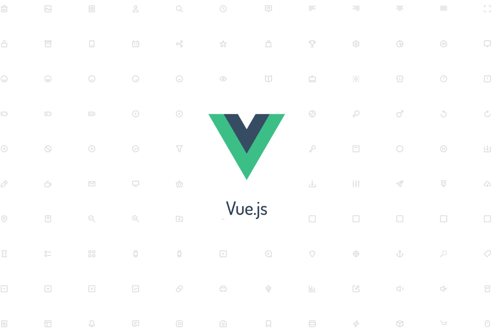

###### VueJS

Vue.js 의 모든걸 가져갈 강의 — 탄탄한 기본기를 갖춘 프론트엔드 개발자로 거듭납시다.

Vue.js의 장점을 제대로 활용하기 위해서는 ES6 나 Babel, Webpack, SPA 등의 개념을 체득하고 있어야 합니다.
하지만 이 개념들을 익히다보면 정작 Vue 를 본격적으로 시작해보지도 못하고 금세 지쳐버리고 말죠.
또한 웹 프론트엔드 기술일지라도 백엔드에 대한 이해가 없다면 웹 환경에 대한 확장된 지식을 쌓기가 어렵습니다.

우리는 약 60시간 동안 Vue.js로 SPA를 개발하는 기술은 물론 아키텍쳐, 객체지향 프로그래밍, 모던 웹 개발 패러다임 등 백엔드에 대한 이해까지 체득해봅니다.
단순 프론트엔드 지식만 갖고 있는 것이 아닌, 백엔드 까지 고려한 탄탄한 기본기를 가진 프론트엔드 개발자로 거듭나세요!

